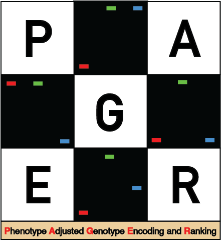

# PAGER

<div align="center">
  
</div>

PAGER : Phenotype Adjusted Genotype Encoding and Ranking
==================================

**PAGER** is a genotype encoding method specifically designed for improving the detection of deviations from additivity in genotype-phenotype associations. It provides a computationally efficient means to capture a variety of inheritance models, including additive, dominant, recessive, and heterotic, without the need for multiple encodings or increased computational cost. By normalizing the relative phenotypic differences between genotypic classes, PAGER reveals novel insights into genetic associations and potential sources of missing heritability.

## Key Features

- Flexible Genotype Encoding: Automatically adjusts to capture a range of inheritance models (additive, dominant, recessive, heterosis) on a SNP-by-SNP basis.
- Phenotype-Driven: Uses phenotypic information to generate genotype encodings, reflecting each variant’s true inheritance model.
- Computational Efficiency: PAGER can be employed in any coding language and can be parallelized and leveraged using GPUs for robust computational efficiency.
- Broad Applicability: Supports binary (case/control), multiclass, and continuous phenotypes, as well as multi-allelic systems.

## Methodology

PAGER encodes genetic variants based on normalized mean phenotypic differences between the three genotype classes (AA, Aa, aa) for each SNP, which reflects the inheritance pattern at each locus.

The encoding is computed as follows:

Let:

- *x̄AA*, *x̄Aa*, and *x̄aa* represent the mean phenotype values (proportion of cases *[p̂]* in case/control studies) for the genotype classes AA, Aa, and aa, respectively, at each SNP.

- The AA class is used as an anchor point for encoding (set to 0).

For each SNP, PAGER calculates the following encoding values (diallelic, non-epistatic example):

- *PAGER EncodingAA = x̄AA − x̄AA = 0* (anchor) 

- *PAGER EncodingAa = x̄Aa − x̄AA*

- *PAGER Encodingaa = x̄aa − x̄AA*

### Normalization

These raw encodings are then normalized using min-max scaling to fall between 0 and 1 for easier interpretability. The normalization ensures that the differences between genotype classes are comparable across all SNPs.

### Key Advantages

1.	**Phenotype-Specific Adjustments:** By directly calculating the phenotypic differences between genotype classes, PAGER dynamically adjusts to the specific inheritance pattern observed in the data, whether additive, dominant, recessive, or heterotic.
2.	**Scalability:** The simple mathematical operations make PAGER computationally efficient, particularly for large-scale studies. GPU support and parallelization further accelerate computation.
3.	**Extensibility:** PAGER can handle multi-allelic systems and variants. Extension is achieved by using one genotype as the anchor and computing the relative differences for others.

## Usage and Examples

We provide code usage examples of PAGER in the [Scripts](https://github.com/EpistasisLab/PAGER/tree/main/Scripts) directory in both Python and R programming languages. Data used to run these examples are in the [Data](https://github.com/EpistasisLab/PAGER/tree/main/data) directory.

## Relevant Publications

If you use PAGER in scientific publications, please cite the following:

Freda, Philip J., Attri Ghosh, Priyanka Bhandary, Nicholas Matsumoto, Apurva S. Chitre, Jiayan Zhou, Molly A. Hall, Abraham A. Palmer, Tayo Obafemi-Ajayi, and Jason H. Moore. 2024. **PAGER: A novel genotype encoding strategy for modeling deviations from additivity in complex trait association studies.** *BioData Mining*, 17(1), 41.

[Link](https://link.springer.com/article/10.1186/s13040-024-00393-x) to publication.

```bibtex
@article{freda2024pager,
  title={PAGER: A novel genotype encoding strategy for modeling deviations from additivity in complex trait association studies},
  author={Freda, Philip J and Ghosh, Attri and Bhandary, Priyanka and Matsumoto, Nicholas and Chitre, Apurva S and Zhou, Jiayan and Hall, Molly A and Palmer, Abraham A and Obafemi-Ajayi, Tayo and Moore, Jason H},
  journal={BioData Mining},
  volume={17},
  number={1},
  pages={41},
  year={2024},
  publisher={Springer}
}
